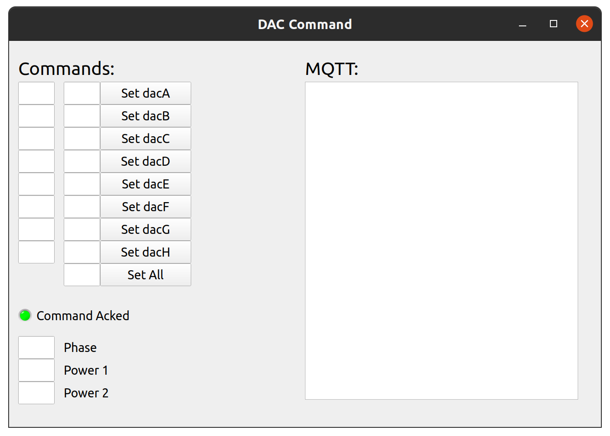

# VoltageController
Voltage Controller for the w/2w experiment

### Cable

The cable connecting the RPi to the DAC board was custom made (if you couldn't tell by the electrical tape) with the following pinout:

### Mosquitto (MQTT Broker)

Install mosquitto:

` sudo apt install mosquitto `

To run mosquitto in verbose mode:

` mosquitto -c mosquitto.conf -v `

To ensure it runs on startup (and run it now):

` sudo systemctl enable mosquitto && sudo systemctl start mosquitto `

You also have to copy the `mosquitto.conf`:

` sudo cp mosquitto.conf.etc /etc/mosquitto/mosquitto.conf ` 
` sudo cp mosquitto.passwd /etc/mosquitto/mosquitto.passwd `

### Command UI

To install dependancies:

`sudo apt install python3 python3-paho-mqtt python3-pyqt5`

And to run the main UI:

`python3 server/server.py`

The UI looks like this:

Where numbers should be entered into the boxes and then the respective button is pressed to send the comand to the RPi in order to update the DAC. The DACs can be set all at once via the very last box/button. 

If your command was acknowledged by the RPi, it will send back an "ACK", and the light will turn green, otherwise it will remain red, and you will know something went wrong.

### RPi Setup

To install dependancies:

`sudo apt install python3 python3-paho-mqtt python3-smbus`

`sudo pip3 install adafruit-circuitpython-busdevice adafruit-circuitpython-ads1x15 adafruit-blinka`

`sudo pip3 install --upgrade RPi.GPIO adafruit-blinka`

To run the script on startup add the following line to the user crontab (via running `crontab -e`):

`@reboot /home/USER/VoltageController/RPi/startup.sh`

And save and exit.

To start the program now, you can run:

`./startup.sh`

Or simply reboot.
